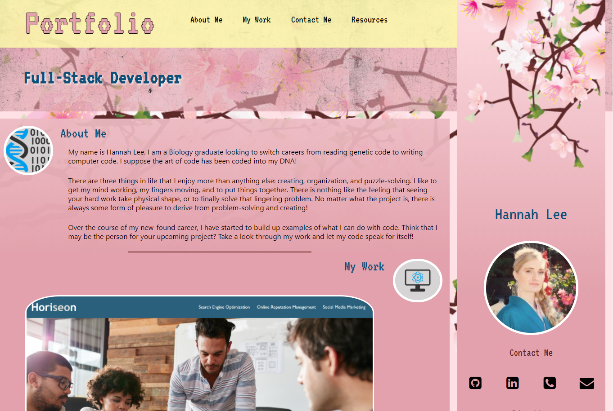

# Hannah Lee's Portfolio

## Description 
Every new coder stepping into the field needs to show off their abilities, and what better way than to deploy a portfolio designed by their very own hands? 

The portfolio consists of three major sections: About Me, My Work, and a Contact Me navigation bar. With a brief glance you can learn a little bit about me, and view my past coding work with the click of the mouse. A navigation bar has been included at the top to access any part of the page!

Have I peaked your interest? Take a look! If you think I'm the candidate for you, please feel free to reach out to me by phone number or email!

#### Deployed Link: [Hannah Lee's Coding Portfolio](https://hanlee-311.github.io/hannah-lee-portfolio/)

## Features
- Navigation bar to different sections of a page. No need to scroll to find what you need!
- A snapshot about me in an About Me section.
- Preview of my works, linked directly to my deployed code. 
- Links to my GitHub, LinkedIn, and ways to contact me. 
- Resources links at in the footer. 
- Website display changes depending on the size of the media screen. 

## Resources

- [Cherry Blossom Image](https://www.kindpng.com/imgv/iRxbRm_cherry-blossom-png-free-download-cherry-blossom-tree/)

- [Genetic and Binary Code Clipart](https://www.clipartmax.com/middle/m2H7G6Z5d3b1K9d3_dna-code-icon-clipart-dna-genetics-dna-binary/)

- [Computer Science Clipart](https://www.clipartmax.com/middle/m2i8H7i8G6H7N4b1_technology-enhanced-science-investigations-computer-science-logo-png/)

- [Font Awesome Icons](https://fontawesome.com/v4.7.0/)

- [Texture Overlay Image by fictionchick](https://www.deviantart.com/fictionchick/art/Grunge-Texture-Overlay-PNG-428805936)

- [CSS Garden - Layout Inspiration](http://www.csszengarden.com/215/)

- [Draw.io - Wireframing Resource](https://app.diagrams.net/)

